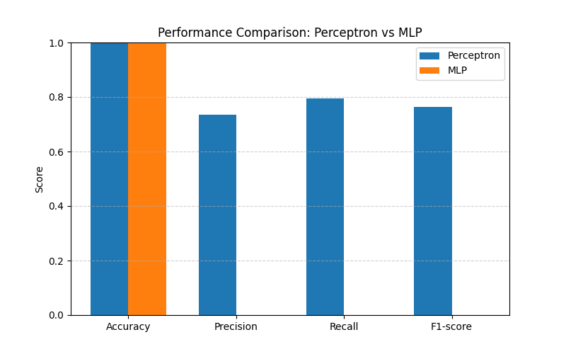
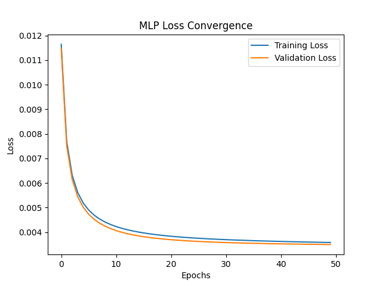
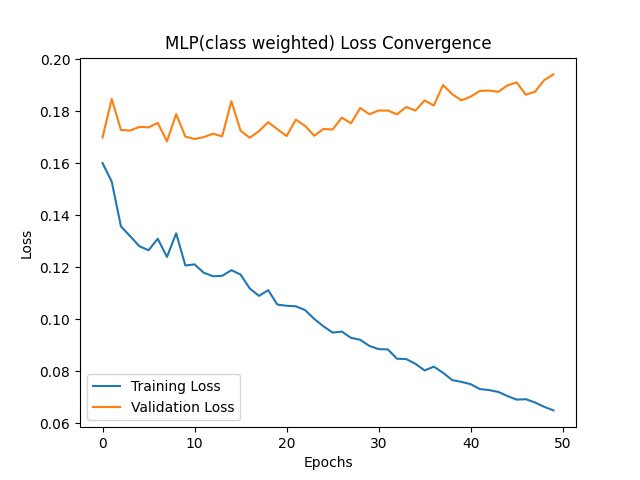
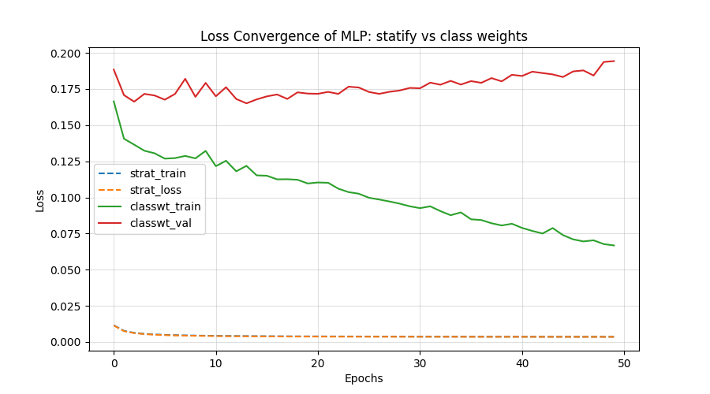

# Assignment 1 - DL

## Dataset used: https://www.kaggle.com/datasets/isaikumar/creditcardfraud 
This dataset is a credit card fraud detection dataset containing 492 frauds out of 284, 807 transactions that happened in the duration of 2 days. 
There have been feature reduction techniques like PCA applied on this dataset. hence the features have been brought down to V1..V8. 

- This dataset is highly unbalanced, the target class is positive only 0.172% of all the transactions

- Note:
    - Confusion Matrix is not a meaningful measurement of accuracy in the case of an unbalanced dataset. ROC-AUC curves are better for such cases.
    -Imbalance is too high since it is a realistic scenario.

### 1: Preprocessing the data

i. check for any null or missing values 
    -> no irregularities found

ii. Normalization
To ensure there is no bias in the dataset, the normalization is done after the train/test split. 

### 2: Implementing a perceptron from scratch

1. y = sigma(x_i*w_i)+b
2. update b
3. predict

```python
Perceptron Test Metrics:
Accuracy: 0.9992
Precision: 0.7358
Recall: 0.7959
F1-score: 0.7647
```

### 3. Implementing an mlp from scratch
1. create and initialize the concatenate
**bias is trained, not fixed. so the computation of the bias is done while iterations are going on**
2. start off with random weights, later train them to achieve optimal accuracy
3. activation function used in this: Sigmoid
4. Loss function: Binary Cross Entropy
5. Forward pass: 
    - z1 = sigma(x, w1)
    - a1=activ_fn(z1)
    - y_pred = activ_fn(z2)
6. Backward pass: 
    - loss=y_pred-y
        -loss=y_pred-y
    - error propagated to hidden layer
    - local grad of i/p
7. mlp metrics are defined: epochs = #, learning rate = #, batch size = #
8. Training the MLP:
    - shuffling
    - gradient descent applied 
    - loss is calculated
9. Results: 
```python
MLP Test Metrics:
Accuracy: 0.9991
Precision: 0.6949
Recall: 0.8367
F1-score: 0.7593
```

### 4. Imbalance in the dataset
There is a huge [99.8:0.2] percent imbalance to the non-fraud to fraud target. To preserve it, the preferred technique was to combine stratify and class weights.

### When the decision threshold is changed while using simple stratify
A significant change is seen as the threshold changes even in (1/10)th. 
Initially in the simple stratify MLP, when the threshold is taken as 0.5, the precision and recall achieved were 0.00
```python 
return (y_hat >= 0.5).astype(int)
```

But, when this threshold was decreased to 0.1, the achieved results were 80% higher than before. 
```python
return (y_hat >= 0.1).astype(int)
```
This indicated that this method clearly was not effective in handling this imbalance.

### Why class weights? 
This method in specific, gives appropriate weights taking into account the minority and majority classes. 
To solve the imbalance in this problem, we initially assume some random weights.
 at the end, the weights sum up to appropximately:
 ```python
 weight[0] ≈ 0.5008661206149896, 
 weight[1] ≈ 289.14340101522845
```


### 5. Result comparison
### a. Perceptron vs MLP performance

Obseervations: 
1. Accuracy(the proportion of total predictions that are correct) of both the preceptron and the MLP are extremely high (~99.999%) since the dataset is highly imbalanced consisting of true negatives.

2. Precision(how many of the predicted +ve samples are truly poitive) The model predicts the fraud for 70% of the cases.

3. Recall(How many true +ve samples are correctly identified): MLP detects a higher proportion of true fraud cases, better than a perceptron.

4. F1-score(harmonic mean of precision and recall): MLP captures more complex patterns

### b. (i) MLP performance: loss curve


What we observe?
1. Both the training and validation losses decrease with increase in the no. of epochs
2. No divergence is seen, and both the curves are very close to each other.
- LR = 0.01 is appropriate
- GD is working fine
- No overfitting is seen 

(ii)


### c. MLP stratify vs MLP stratify+class weights

```python
MLP: Stratified
Accuracy : 0.9982795547909132
Precision: 0.0
Recall   : 0.0
F1-score : 0.0

MLP Stratified + Class Weight
Accuracy : 0.9790211017871564
Precision: 0.07047768206734534
Recall   : 0.9183673469387755
F1-score : 0.13090909090909092
```

This clearly indicates that the method of combining stratify and class weights worked extremely well.

In the normal stratify imbalance, we tried to implement a Binary cross entropy. This was not sufficient since it was biased entirely toward class 0.

But by adding appropriate weights, though we see a very low precision, it seems it is a trade-off with recall, while the accuracy is pretty good and looks like the case of overfitting is resolved [99.999% in the case of normal MLP]

